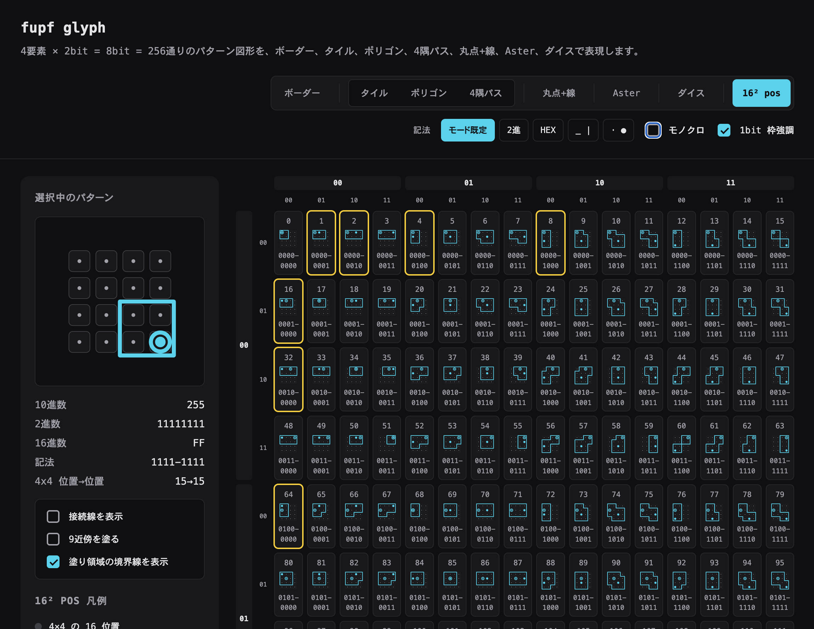

[](https://github.com/elzup/oparts-spec)

# fupf glyph

`4↑4 = 4^4 = 256` 通りのパターン図形を可視化するプレビューです。



サイト内の Clock demo では、現在の HH・MM・SS をそれぞれ 256 パターンからほぼ等間隔にサンプルして表示します。

## ファイル

- `src/` — React + TypeScript のソースコード
  - `lib/renderers/` — 各モードの SVG 生成ロジック
  - `components/` — React コンポーネント
- `index.html` — Vite エントリーポイント

## モード

- **ボーダー**: 4辺 × 2bit の線スタイル
- **タイル**: `4^4 map type`
- **ポリゴン**: `4^4 map type`
- **4隅パス**: `4^4 graph type`
- **丸点+線**: `2^4 * 4^2 type`
- **Aster**: `2^8 type`
- **ダイス**: `4^4 box type`（サイコロ展開図から1枚欠けた十字。上右下左の各マスで四隅から1つ選び閉路に結ぶ。辺の配色は単色/45°/位置/グラデを選択可）
- **16² pos**: `16^2 pos type`（4×4 グリッドの 16 位置から開始・終了を選び、有向な線を引く。上位4bit=開始位置、下位4bit=終了位置）
- **あみだ**: `4^3 * 4 amida type`（4本の縦棒に対し、上・中・下の各段で「横線なし／1–2／2–3／3–4」を選び、開始位置4択から経路を辿る。通らなかった横線を強調し、横線にも経路にも触れない縦棒は通常色／別色／非表示を選択可）

## 開発

```bash
ni        # 依存関係をインストール
nr dev    # 開発サーバー起動
nr test   # テスト実行
nr build  # 本番ビルド（dist/ に出力）
```

## 公開

GitHub Pages で公開しています: https://elzup.github.io/fupf/
